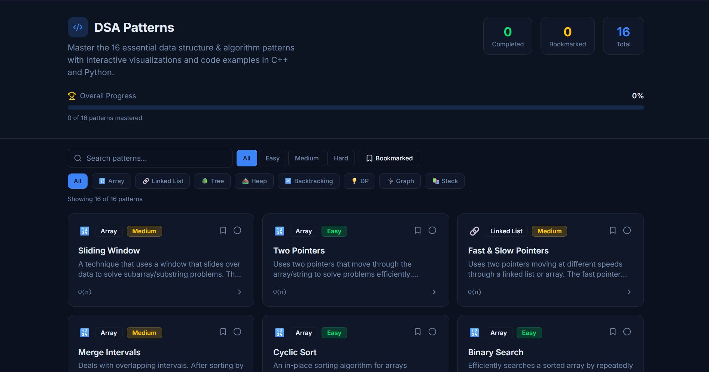

# DSA Patterns — Interactive Learning App

A React + Vite app that teaches 16 essential DSA patterns with live animated visualizations, C++ and Python code examples, and a progress tracker.



## Features

- 16 DSA patterns: Sliding Window, Two Pointers, Fast & Slow Pointers, Merge Intervals, Cyclic Sort, Binary Search, Tree BFS/DFS, Two Heaps, Subsets/Backtracking, Modified Binary Search, Top K Elements, K-way Merge, Dynamic Programming, Graph BFS/DFS, Monotonic Stack
- Live animated visualizations for every pattern
- C++ and Python code examples with syntax highlighting
- Progress tracker (mark complete, bookmark) — persisted in localStorage
- Filter by category, difficulty, search

## Setup

### Prerequisites

- [Node.js](https://nodejs.org/) v18 or higher
- npm, yarn, or pnpm

### Install & Run

```bash
# Install dependencies
npm install

# Start development server
npm run dev
```

Open http://localhost:5173 in your browser.

### Build for Production

```bash
npm run build
# Output goes to ./dist/
# Serve with:
npm run preview
```

You can host the `dist/` folder on any static hosting service (Netlify, Vercel, GitHub Pages, etc.).

## Project Structure

```
src/
├── App.tsx                          # Root app with routing
├── index.css                        # Theme & global styles (dark mode)
├── main.tsx                         # Entry point
├── data/
│   └── patterns.ts                  # All 16 DSA patterns data
├── store/
│   └── progress.ts                  # Zustand store (progress tracker)
├── pages/
│   ├── Home.tsx                     # Pattern grid + filters + progress bar
│   ├── PatternDetail.tsx            # Individual pattern detail page
│   └── not-found.tsx
├── components/
│   ├── CodeBlock.tsx                # Syntax-highlighted code
│   ├── PatternVisualization.tsx     # Visualization router
│   ├── visualizations/
│   │   ├── ArrayVisualization.tsx
│   │   ├── TreeVisualization.tsx
│   │   ├── LinkedListVisualization.tsx
│   │   ├── HeapVisualization.tsx
│   │   ├── GraphVisualization.tsx
│   │   ├── MatrixVisualization.tsx
│   │   ├── StackVisualization.tsx
│   │   └── IntervalsVisualization.tsx
│   └── ui/                          # shadcn/ui components
├── hooks/
└── lib/
    └── utils.ts
```
